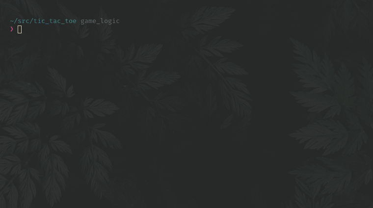

# Tic_Tac_Toe

Tic-Tac-Toe game implemented in Ruby.

## Playing the game

- Clone the repository.
- Open a terminal on the containing folder of this project
- bundle install
- ruby bin/main.rb

## Authors

👤 **Michael Threels**

- Github: [@githubhandle](https://github.com/mikethreels)
- Twitter: [@twitterhandle](https://twitter.com/MichaelThreels)
- LinkedIn :[@linkedinhandle](https://www.linkedin.com/in/michael-threels-24101991)

👤 **Hasan Kharouf**

- Github: [@githubhandle](https://github.com/WinterCore)

## About Tic Tac Toe Game

It's game in which two players alternately put Xs and Os in compartments of a figure formed by two vertical lines crossing two horizontal lines and each tries to get a row of three Xs or three Os before the opponent does.

## RULES FOR TIC-TAC-TOE

The game is played on a grid that's n squares by n squares.
You are a shape you choose, your friend is another shape he chooses. Players take turns putting their marks in empty squares.
The first player to get n of his/her marks in a row (up, down, across, or diagonally) is the winner.
When all squares are full, the game is over. If no player has n marks in a row, the game ends in a tie.

## INSTRUCTIONS TO PLAY

- Write first players name and pick a shape and do the same for the second player
- Pick the size of the board you want to play with (number of rows)
- Choose a number from the grid to mark it with the player's symbol, then it's the turn of the next player to do the same.
- If a player gets n symbols in a row (up, down, across, or diagonally) is the winner. If all squares are full and none has the n symbols the game ends in a tie.

## Contributing

Bug reports and pull requests are welcome on GitHub at https://github.com/mikethreels/tic_tac_toe.
